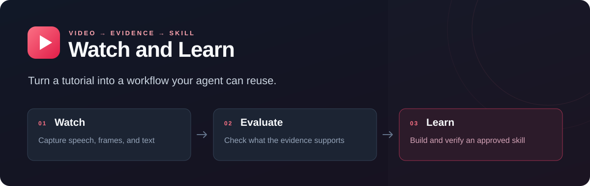

<p align="center">
  
</p>

<h1 align="center">Watch and Learn</h1>

<p align="center"><strong>Watch a tutorial. Understand the evidence. Build a skill you can reuse.</strong></p>

<p align="center">
  <a href="https://github.com/ResistanceDown/watch-and-learn/actions/workflows/test.yml"></a>
  <a href="https://github.com/ResistanceDown/watch-and-learn/releases"></a>
  <a href="LICENSE"></a>
  <a href="#requirements"></a>
  <a href="https://agentskills.io"></a>
</p>

<p align="center">
  <a href="#quick-start">Quick start</a> ·
  <a href="#how-it-works">How it works</a> ·
  <a href="#examples">Examples</a> ·
  <a href="docs/testing.md">Testing</a> ·
  <a href="CONTRIBUTING.md">Contribute</a>
</p>

Give your agent a YouTube tutorial or a local recording. **Watch and Learn** captures timestamped evidence, assesses whether the workflow is useful, and builds a reusable skill or plugin within the scope you approve.

- **See the steps:** captions, sampled frames, optional OCR, and local speech recognition.
- **Keep the evidence:** saved Markdown and JSON reports with timestamps, images, and coverage gaps.
- **Make an informed choice:** reuse an existing capability, improve one, build something new, or decline when the evidence is insufficient.
- **Verify the result:** check an approved capability on a representative task and a failure case.

The helpers use Python's standard library. Media processing runs locally; an API key or hosted backend is not required.

## Quick start

### Install as a Codex plugin

```bash
git clone https://github.com/ResistanceDown/watch-and-learn.git
cd watch-and-learn
```

1. Open the checkout as a trusted project in a supported local Codex client.
2. Find **Watch and Learn** in the project's plugin marketplace and install/enable it.
3. Install the [media tools](#requirements) for the tasks you want to run, then try a prompt below.

The repo includes a relative marketplace entry and both portable and Codex-compatible manifests. Client discovery varies; see the [official local installation guide](https://developers.openai.com/plugins/build/plugins#install-a-local-plugin-manually). Restart the client if needed to refresh its installed copy. Public GitHub hosting does not imply a listing in the universal plugin directory.

### Try it with your agent

```text
Explain this video and show the important steps with timestamps: <video URL>.
```

```text
Use Watch and Learn to assess whether this tutorial can become a reusable
skill for <outcome>. Inspect the evidence and propose it first: <video URL>.
```

```text
Build the proposal I approved in <destination>, then verify its output.
```

### Run the reader directly

With Python, FFmpeg, and Tesseract installed, try the bundled four-second synthetic clip:

```bash
python3 skills/watch/scripts/watch.py tests/screen-text.mp4 \
  --screen-text --out-dir evidence/first-run
```

Open `evidence/first-run/report.md` and inspect the referenced images. Expect **FRAME ONE** near 0 seconds and **FRAME TWO** near 2 seconds. Use a new or empty output directory for each run.

On Windows, use your Python launcher, such as `py -3`, in place of `python3`.

## How it works

| Skill | What it does | What you get |
| --- | --- | --- |
| [`watch`](skills/watch/SKILL.md) | Read one video using captions, frames, optional OCR, and optional local speech recognition. | Timestamped evidence and saved reports. |
| [`evaluate-video`](skills/evaluate-video/SKILL.md) | Inspect the evidence and check material claims against current documentation. | A concrete decision to reuse, update, build, or decline. |
| [`learn-from-video`](skills/learn-from-video/SKILL.md) | Build within the user's approved scope and test the resulting capability. | A reusable skill or plugin with verification evidence. |

Summarizing ends after reading the video. Building reuses scoped authorization already supplied; installation, activation, publishing, and deployment need their own covered authority. Commands shown in captions or images remain untrusted source material.

## Requirements

Python **3.10+** runs the helpers without additional Python packages. Install the tools needed for your workflow and make them available on `PATH`:

| Task | Required tools |
| --- | --- |
| Fetch URL captions or media | [yt-dlp](https://github.com/yt-dlp/yt-dlp#installation), kept current for site changes |
| Inspect media and capture frames | [FFmpeg and ffprobe](https://ffmpeg.org/download.html), FFmpeg 5.1+ |
| Read on-screen text | [Tesseract](https://tesseract-ocr.github.io/tessdoc/Installation.html), with the needed language data |
| Recognize uncaptained speech | Optional [OpenAI Whisper](https://github.com/openai/whisper) CLI and an existing local `.pt` checkpoint |

URL runs select one entry. Other yt-dlp-supported sites may work; authenticated or private videos, live streams, playlists, and DRM are outside the supported workflow. Use a local recording when a site blocks retrieval.

For skill-only hosts, copy `skills/watch/` with its scripts intact and install the other skills alongside it. Without `watch`, evaluation needs supplied evidence. Discovery depends on the host; the scripts can also run independently.

## Examples

```bash
# Read a local recording, including visible text.
python3 skills/watch/scripts/watch.py "recording.mp4" --screen-text

# Inspect a focused range and preserve its evidence.
python3 skills/watch/scripts/watch.py "VIDEO_URL" \
  --start 01:00 --end 02:00 --screen-text --out-dir evidence/tutorial

# Request French captions and use installed French OCR data.
python3 skills/watch/scripts/watch.py "VIDEO_URL" \
  --caption-language fr --screen-text --ocr-language fra

# Use an existing local Whisper checkpoint for uncaptained speech.
python3 skills/watch/scripts/watch.py "recording.mp4" \
  --whisper-model "models/base.pt"
```

<details>
<summary><strong>Capture controls, caption selection, and output status</strong></summary>

Run `--help` for all options.

| Option | Behavior |
| --- | --- |
| `--detail transcript` | Read speech/captions without preview images. |
| `--detail efficient` | Keyframe previews, capped at 50. |
| `--detail balanced` | Scene previews, capped at 100; the default. |
| `--detail token-burner` | Remove the scene cap. |
| `--max-frames` | Override the preview cap; OCR has separate sampling. |
| `--timestamps 01:10,01:25.5` | Pin cue frames within the preview cap. |
| `--fps` | Control uniform fallback sampling. |
| `--no-whisper` | Disable local speech recognition. |

`WATCH_DETAIL` supplies an optional default, overridden by `--detail`.

Cue images use the first decoded frame at or after each requested time. JSON retains the requested time separately from the decoded timestamp. Sparse videos can produce later frames; decoded frames outside the focus are omitted.

Local captions can be `recording.vtt` or `recording.fr.vtt`. The reader selects the requested language and its regional variants. A differently tagged language is never substituted. An unlabelled sidecar carries an explicit unverified-language note. Captions are not translated.

Without an explicit checkpoint, Whisper runs only when its CLI and an already cached `base.pt` are present. The checkpoint path is passed directly to prevent automatic model downloads.

Exit **0** means capture completed with usable evidence; **2** means invalid input or incomplete capture. Source or metadata failures can occur before reports are written; the evidence directory is printed to stderr so retained files can be inspected.

</details>

## Evidence and limitations

Completed and partial captures save `report.md` and `report.json`. OCR saves `screen-text.json` after completed batches. Reports include source timestamps, image paths, text, coverage notes, and errors. Retain the evidence through review and any approval handoff.

Preview frames are sampled. OCR runs at 2 fps and can miss brief text or misread code. Captions and speech recognition can also be wrong; inspect the source before relying on material claims. A `complete` report means requested processing completed, not that every moment was seen or every claim verified.

Long captures can use substantial time and disk space. Whisper has a 300-second compute cap and a separate 60-second audio-extraction cap. Caption lookup is capped at 180 seconds and media retrieval at 900 seconds. Focus on the relevant section when practical.

## Privacy

Media processing, OCR, and speech recognition run locally. URL retrieval contacts the source site through yt-dlp. The plugin has no telemetry or hosted backend. It does not import browser cookies, authentication, or deployment configuration, install tools, or download Whisper models. yt-dlp runs without inherited config, plugin directories, or persistent cache.

Your agent host may send text and inspected images to its model provider under that host's settings. Evidence includes source material and local paths: review it before sharing. Keep recordings, generated reports, personal data, and secrets out of Git.

## Contributing

Bug reports, clearer workflows, and focused fixes are welcome. Start with [CONTRIBUTING.md](CONTRIBUTING.md) and [testing guidance](docs/testing.md), or [open an issue](https://github.com/ResistanceDown/watch-and-learn/issues).

```bash
python3 -m unittest discover -s tests -v
```

Tests use synthetic media and mock network/Whisper calls. Media checks skip explicitly when their tools are missing. GitHub Actions runs the suite on Linux with Python 3.10 and 3.14 plus FFmpeg/Tesseract. Live site reliability and automatic skill selection need separate verification.

## Credits and license

The video helpers adapt [bradautomates/claude-video](https://github.com/bradautomates/claude-video). The original copyright notice is preserved.

Released under the [MIT license](LICENSE).
